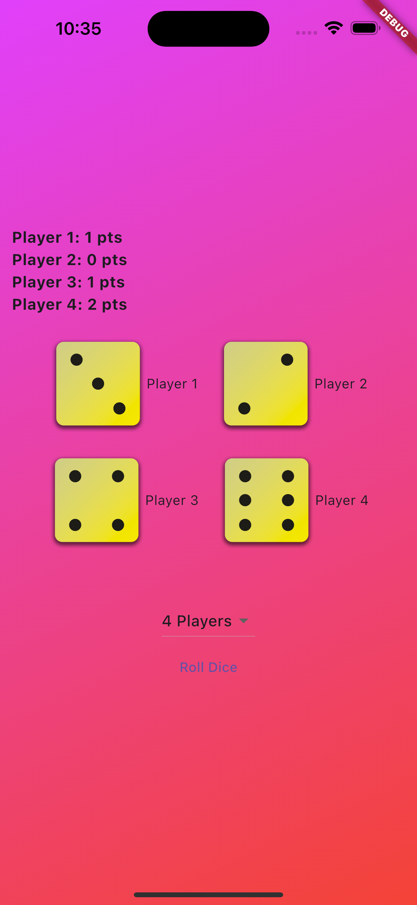
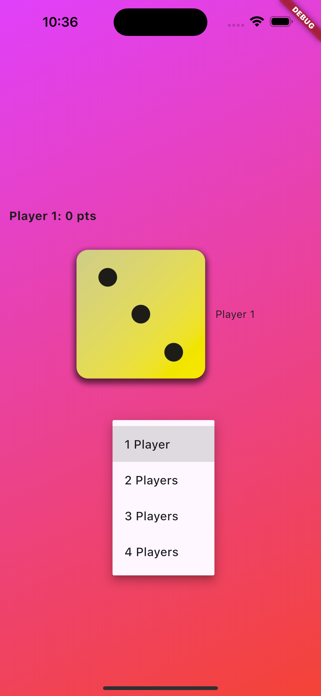
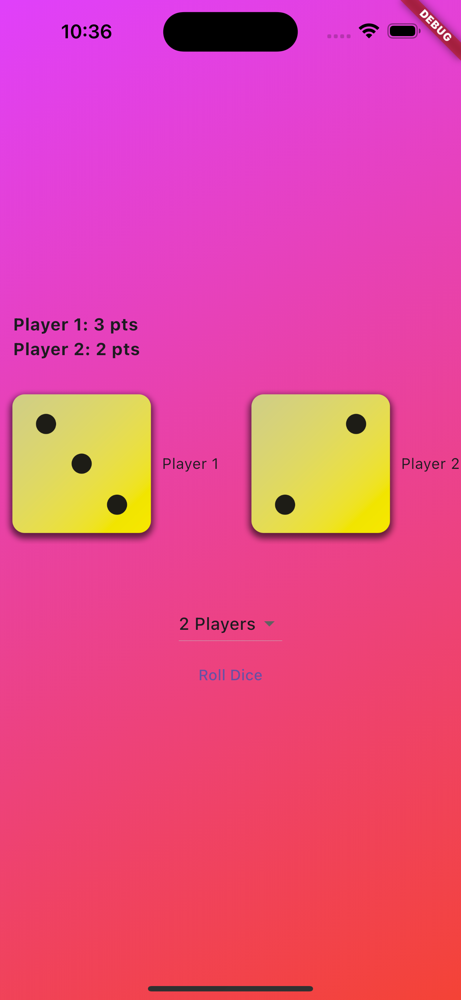

# 📱 Project Title

Dice Roll Game is a simple and fun project developed using Flutter & Dart as part of my learning journey in mastering the fundamentals of programming. The game simulates a classic dice-rolling experience with support for multiple players (locally) and additional features to enhance gameplay.

The main goal of this project is to practice and strengthen my understanding of Flutter concepts, especially the use of StatelessWidget and StatefulWidget.
---

## 🔧 Features

- 🎮 Multiplayer support (e.g., 1 to 4 players on same device)
- 🎲 Random dice generation
- 🧠 Game logic (scoring, winner detection)
- 🔁 Reset / Restart option
- 🔁 Multi-Round Gameplay with Score Tracking
- 🛠 Built using Flutter & Dart

---

## 📸 Screenshots
> 
> 
> 

---