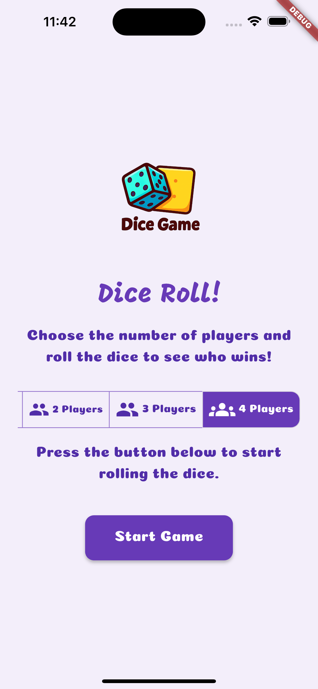
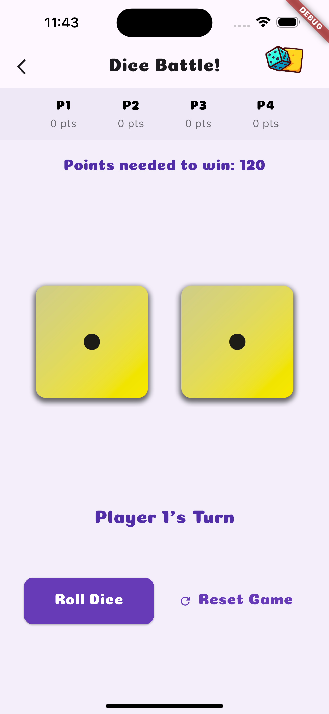
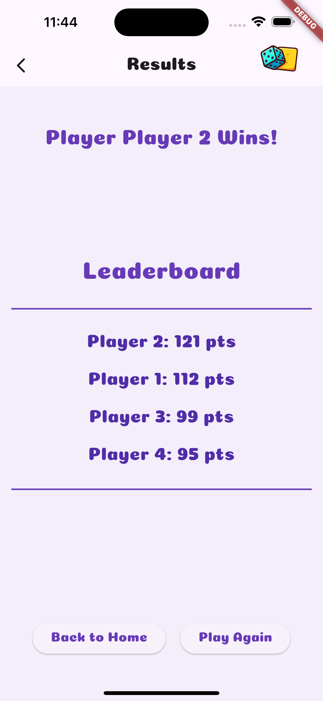

# 🎲 Dice Roll Game — Version 2

**Note:** This project is an **enhanced version of my original Dice Roll Game**, created as part of my journey learning Dart & Flutter.  
I built Version 2 **after completing the basics**, focusing on structured multi-screen navigation, turn-based gameplay, and a polished results system.

**Note:** Although Version 2 uses multiple screens (Home, Game Play, Results), the navigation is handled simply by calling the screen constructors on button presses. This approach allowed me to explore **basic multi-screen flow** without diving into advanced routing techniques.

Welcome to **Dice Roll Game V2**, a **complete redesign and major upgrade** to the classic dice game built with Flutter & Dart.  

This version isn’t just an update — it’s a **reimagined experience**:  
from a single static screen into a **dynamic, multi-screen game** with clear win conditions, turn-based gameplay, and a polished results system.  

---

## 🚀 What’s New in Version 2?  

- ✨ **Brand-new UI/UX** — redesigned from the ground up  
- 🖥 **Three dedicated screens** for a smoother flow:  
  - 🏠 **Home Screen** → Choose players & start  
  - 🎮 **Game Play Screen** → Turn-based rolling with live score tracking  
  - 🏆 **Results Screen** → Winner announcement + leaderboard  
- 🎲 **Turn-based mechanics** — players take turns rolling  
- 🏅 **Win condition system** — finally, the game declares a real winner  
- 📊 **Leaderboard rankings** — all players are ranked with their final scores  
- 🔘 **More control options** → Reset, Play Again, Home navigation, etc.  

---

## 📸 Screenshots (V2)  
> 
> 
> 
---

## 🔄 Version 1 vs Version 2 — Quick Comparison

Here’s a clear look at how the game **evolved from V1 to V2**:

### 🎨 UI & Screens
- **Version 1:** Single, basic screen  
- **Version 2:** Three dedicated screens — Home, Game Play, Results  
- **Impact:** Smoother navigation and better user experience

### 🎮 Gameplay
- **Version 1:** Simple dice rolling  
- **Version 2:** Turn-based rolling with live scoring  
- **Impact:** More engaging and competitive gameplay

### 🏆 Win & Leaderboard
- **Version 1:** No winner system  
- **Version 2:** Automatic winner declaration + leaderboard of all players  
- **Impact:** Clear objectives and post-game feedback

### 🔘 Controls
- **Version 1:** Only Reset  
- **Version 2:** Reset, Play Again, Home  
- **Impact:** More flexibility and better flow for replaying

### 📊 Visual Representation
> **Version 1** ➡️ **Version 2**  
>  ➡️ 
---